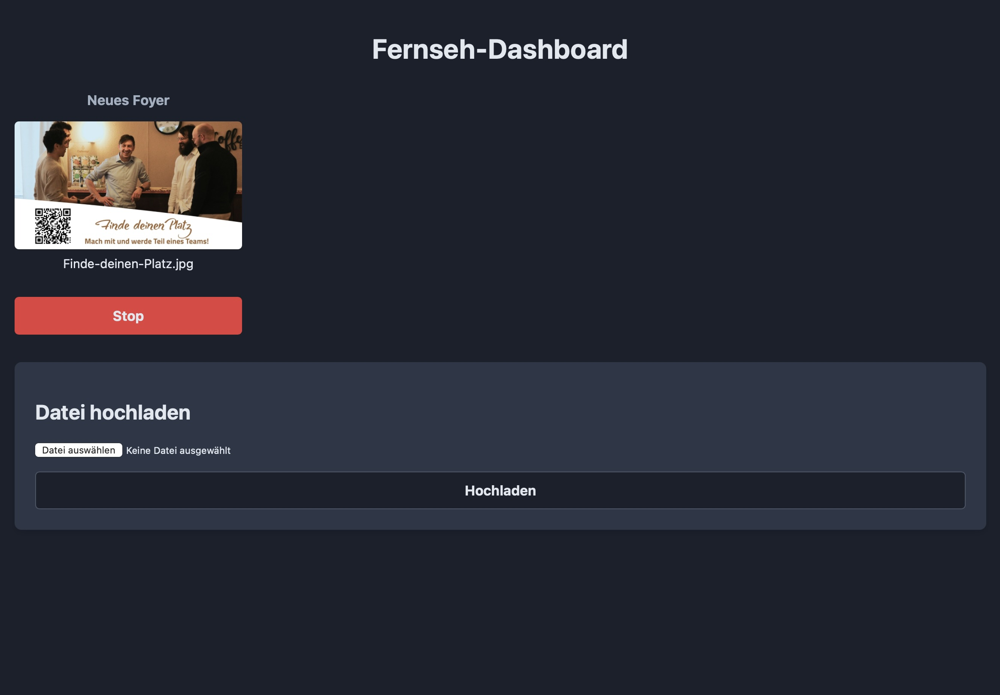

# Catt Web UI - Fernseh-Dashboard

Ein einfaches, geräte-zentriertes Web-Dashboard zur Steuerung von `catt` (Cast All The Things) auf einem Server. Es ermöglicht das Hochladen und Streamen von lokalen Mediendateien auf mehrere Chromecast-Geräte im Netzwerk.



## Features

*   Automatische Erkennung von Chromecast-Geräten im Netzwerk.
*   Geräte-zentriertes Dashboard zur unabhängigen Steuerung jedes Empfängers.
*   Anzeige des aktuellen Streams (inkl. Thumbnail) pro Gerät.
*   Hochladen neuer Mediendateien direkt über die Weboberfläche.
*   Löschen von Mediendateien aus der Bibliothek.

## Setup & Installation

Dieses Projekt wurde mit KI auf einem Ubuntu-Server entwickelt. Wir nutzen es in unserer Kirchengemeinde, um Infos auf verschiedenen Screens anzuzeigen.

**1. Klonen Sie das Repository:**
```bash
git clone https://github.com/hixhupf/catt-web-ui.git
cd catt-web-ui
```

**2. Erstellen Sie eine virtuelle Umgebung und installieren Sie die Abhängigkeiten:**
```bash
python3 -m venv venv
source venv/bin/activate
pip install -r requirements.txt
```

**3. Installieren Sie die System-Abhängigkeiten:**
```bash
# catt selbst installieren (falls noch nicht geschehen)
pip install catt

# ffmpeg für die Thumbnail-Generierung installieren
sudo apt update && sudo apt install ffmpeg
```

**4. Konfigurieren Sie die Anwendung:**
Öffnen Sie `app.py` und passen Sie die folgenden Pfade an Ihre Umgebung an:
*   `CATT_EXECUTABLE`: Der absolute Pfad zu Ihrer `catt`-Installation (z.B. '/opt/catt-web-ui/venv/bin/catt').
*   `MEDIA_FOLDER`: Der absolute Pfad zum Ordner, in dem Ihre Medien gespeichert werden sollen (z.B. '/opt/catt-web-ui/media').

**5. Richten Sie den `systemd`-Service ein:**
Erstellen Sie eine Service-Datei, um die Anwendung im Hintergrund laufen zu lassen.
```bash
sudo nano /etc/systemd/system/catt-web.service
```
Fügen Sie den Inhalt aus unserer Konversation ein und passen Sie die Pfade und den Benutzernamen an. Starten und aktivieren Sie dann den Service:
```bash
sudo systemctl daemon-reload
sudo systemctl start catt-web.service
sudo systemctl enable catt-web.service
```

## Benutzung

Öffnen Sie einen Webbrowser und navigieren Sie zu `http://<IP_IHRES_SERVERS>:5000`.
